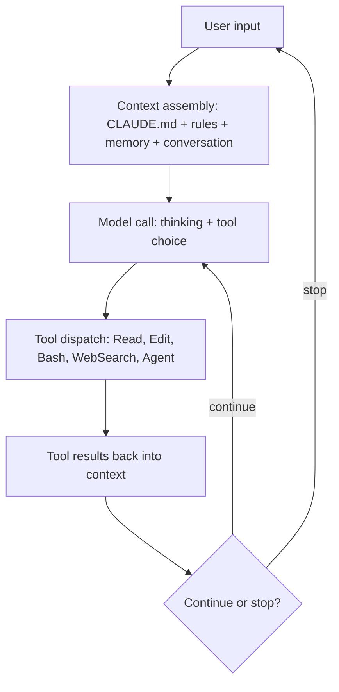

# Chapter 01 — The Mental Model: Claude Code as an Agent Harness

*Last verified: 2026-04-19 — Prerequisites: primer-level Claude Code familiarity — Status: Foundations*

**Builds on:** [`../agents/29-modern-patterns.md`](../agents/29-modern-patterns.md) (Modern Agent Patterns) · [`../agents/05-execution-loop.md`](../agents/05-execution-loop.md) (Execution Loop) · [`../agents/01-what-is-an-agent.md`](../agents/01-what-is-an-agent.md) (What is an Agent).

---

## Concept

Claude Code is an **agent harness** — a runtime that hosts a loop around an LLM plus tools plus context [1][9]. If you've internalized the agent execution loop, you already understand 80% of Claude Code. The remaining 20% is Claude Code's *specific* choices about *which* tools it ships, *how* it manages context, and *what* primitives it exposes for extension.

The mental shift that unlocks mastery: stop thinking about Claude Code as "a chat app in your terminal." Start thinking about it as a **general-purpose agent runtime that happens to include a TUI as one of its frontends.** The CLI, the Agent SDK [5], headless mode, and embedded library usage are all the same harness with different I/O.

## How it works

The Claude Code loop, specialized from `agents/05-execution-loop.md`:

Every turn of the loop assembles a fresh prompt from:

- **System prompt** — Claude Code's built-in instructions about tool use, safety, and conventions [1]
- **CLAUDE.md layers** — user-level, project-level, subfolder-level, in loading order (Chapter 03)
- **`.claude/rules/`** — path-scoped or unconditional rule files (Chapter 04)
- **Auto-memory** — `MEMORY.md` from `~/.claude/projects/<slug>/memory/`, first 200 lines (Chapter 05)
- **Tool definitions** — the enabled subset (see permission modes, Chapter 07)
- **Conversation history** — truncated/compacted as needed (Chapter 06)

The loop terminates when the model decides not to call a tool and returns text to the user. Interrupts (Esc-Esc rewind, user input) can cut it short at any tool boundary.

## The four Claude-Code-specific extension primitives

Where `agents/29-modern-patterns.md` lists general agent patterns, Claude Code crystallizes them into four specific primitives:

| Primitive | Who invokes | When it runs | What it adds |
|---|---|---|---|
| **Slash command** | User types `/name` | On that turn | Prompt template with optional args |
| **Skill** | Model (auto-matched to prompt) or user | When relevant or explicitly invoked | Procedure + domain knowledge + tool set |
| **Subagent** | Orchestrator Claude via `Agent` tool | When delegated | Isolated context window, restricted tools |
| **Hook** | The harness itself | On lifecycle events | Deterministic shell-command execution |

The rest of this master class is a deep dive into when to reach for each (Chapters 11–14 for anatomies, Chapter 25 for the decision tree).

## Why it matters

Treating Claude Code as *the CLI* leads to under-use. Treating it as *an agent harness* changes what problems you see it solving:

- **Reproducible automation** — headless mode + scheduled cron + a skill = a "mini employee" that runs a defined workflow nightly [9]
- **Team tools** — `.claude/skills/` + `.claude/hooks/` committed to a repo = your team's coding-agent behavior is version-controlled like code
- **Research loops** — Ralph patterns in long-running sessions process large unstructured inputs without any custom infra [9]
- **Library usage** — embed the Agent SDK [5] into a Python service; now every request to your API has an agent behind it

The primer gave you the tool. The master class gives you the *primitive*.

## Debugging mental model

When Claude Code behaves unexpectedly, the correct first question is: **"What's actually in the context window right now?"** Not "what did the model hear?" but literally *which files got assembled into the current turn's prompt*.

| Symptom | Likely context issue |
|---|---|
| Ignores my CLAUDE.md rule | CLAUDE.md is too long (> 200 lines); specific rule got de-prioritized. Split into `.claude/rules/` (Ch 04). |
| Didn't use the skill I wrote | `description` field doesn't match the user's phrasing; model didn't auto-suggest. Rewrite description (Ch 12). |
| Lost earlier context | Session was `/compact`-ed; compressed turns dropped detail. `/rewind` to before compaction, re-seed critical context into CLAUDE.md. |
| Used the wrong tool | Tool not listed in `allowed-tools` for the active skill, or permission denied; check `/permissions` (Ch 07). |
| Ran wrong version of something | Auto-memory cached stale info. Audit with `/memory` (Ch 05). |

Treat context assembly as *first-class state you can introspect*. `/memory` shows what CLAUDE.md / rules are loaded. `/cost` shows token accounting. Sessions on disk at `~/.claude/projects/<slug>/` are the raw state (Ch 09).

## Real-world example

A user reports: "Claude keeps ignoring the project style guide." Investigation:

1. `/memory` — confirms `./CLAUDE.md` is loaded. Rule is there.
2. `wc -l CLAUDE.md` — 412 lines. Diagnosis: size-induced adherence decay [2].
3. Fix: Move style rules into `.claude/rules/style.md` with `paths: ["**/*.ts"]` frontmatter — only loaded when editing TypeScript, more focused (Ch 04).
4. Prune `CLAUDE.md` to < 150 lines of what must load every session.
5. Adherence jumps. Confirmed by asking Claude to review a PR against the style rules and checking that flagged items now match.

The root cause wasn't the model "ignoring" anything. It was context assembly — the right rule was there but drowned.

## Key takeaway

**Claude Code is an agent harness, not a chat app.** Its value compounds when you stop using it for single-turn Q&A and start using it for procedures you'd otherwise automate with brittle scripts. The four primitives (commands, skills, subagents, hooks) are your extension points; CLAUDE.md + rules + memory are your state.

## See Also

- [`../agents/29-modern-patterns.md`](../agents/29-modern-patterns.md) — General modern patterns (Claude Code is the reference harness)
- [`../agents/05-execution-loop.md`](../agents/05-execution-loop.md) — The generic loop this specializes
- [`02-on-disk-model.md`](02-on-disk-model.md) — Where state actually lives
- [`25-decision-tree.md`](25-decision-tree.md) — Which primitive for which problem

## Sources

[1] Claude Code Docs — <https://code.claude.com/docs/en/>
[2] Claude Code Best Practices — <https://www.anthropic.com/engineering/claude-code-best-practices>
[5] Agent SDK overview — <https://code.claude.com/docs/en/agent-sdk/overview>
[9] Long-running Claude for scientific computing — <https://www.anthropic.com/research/long-running-Claude>
