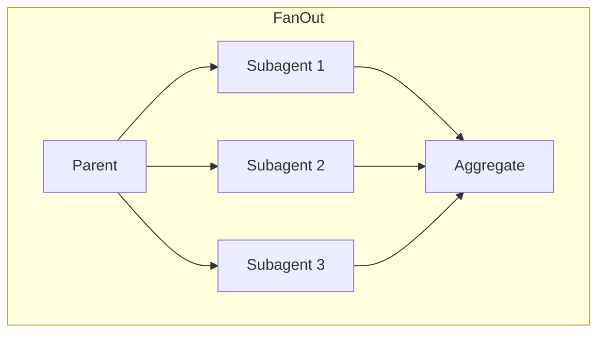
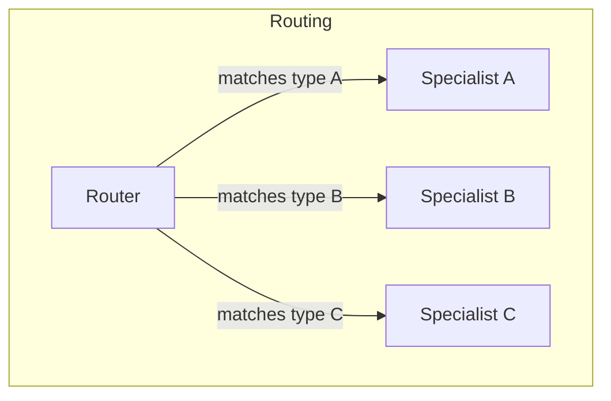
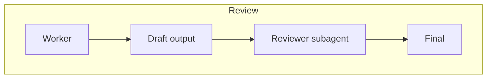

# Chapter 19 — Subagent Orchestration Patterns

*Last verified: 2026-04-19 — Prerequisites: Ch 13, Ch 18 — Status: Advanced*

**Builds on:** [`../agents/14-routing-patterns.md`](../agents/14-routing-patterns.md) (routing) · [`../agents/15-merge-vs-split.md`](../agents/15-merge-vs-split.md) (merge/split decisions) · [`../agents/16-shared-state.md`](../agents/16-shared-state.md) (shared state in multi-agent).

---

## Concept

Subagents in isolation are a context-hygiene tool (Ch 13). Subagents at scale are an **architectural pattern**: you compose multiple specialists, routing work, aggregating output, reviewing in parallel. This chapter covers the orchestration patterns that work well in Claude Code specifically.

Master-class mindset: when you've internalized skills-vs-commands (simple tools), the next level is thinking in terms of **agent topologies** — how specialists, routers, reviewers, and aggregators compose.

## How it works

### The three core topologies







### Pattern 1 — Fan-out for multi-perspective review

Invoke N subagents on the same input, each with a different lens. Classic use: code review with specialist subagents:

- `security-reviewer` — focus on injection, auth, cryptography
- `performance-reviewer` — focus on N+1s, allocation, hot paths
- `style-reviewer` — focus on conventions, naming, readability

Each returns findings; parent aggregates. Three context windows' worth of review for a complex diff, without any one window needing to hold all three concerns.

### Pattern 2 — Router for heterogeneous work

One "router" subagent categorizes incoming work and delegates to a specialist:

```markdown
---
name: bug-triage
description: Categorize a reported bug; route to the right specialist.
tools: Read, Agent
---
Categorize: auth, data, UI, perf, infra.
Delegate to: auth-debugger, data-debugger, ui-debugger, etc.
Return the specialist's result.
```

Keeps the parent context focused on high-level task; the router handles the "which expert" decision cheaply.

### Pattern 3 — Reviewer in the loop

Work → draft output → review pass → final. Use when quality matters more than speed:

```
Worker subagent: implements the feature
  ↓ (output diff)
Reviewer subagent: critiques against a checklist
  ↓ (findings)
Worker subagent: addresses findings, produces final
```

The reviewer runs in isolation — its critique is surgical, not polluted by the worker's reasoning. This is the single most effective quality-boost pattern.

### Pattern 4 — Research + synthesis

Already covered in Ch 13 via `tutor-researcher` + `/tutor`. Generalizes: a researcher gathers structured ingredients; a synthesizer produces final output. Parent orchestrates both.

## Why it matters

Three things improve with good orchestration:

1. **Context hygiene at scale** — as tasks get bigger, the parent's context stays clean because specialists handle their own detail.
2. **Specialization accuracy** — a subagent with a tight, role-specific body outperforms a generalist on its niche. Three specialists beat one generalist on a multi-concern diff.
3. **Composable workflows** — once you have `security-reviewer`, `performance-reviewer`, etc., you reuse them across many workflows. The library of reusable subagents compounds.

## Design rules

**Each subagent does one thing.** Don't build a "code-reviewer-and-test-writer" — build a reviewer and a test-writer separately. Compose at the parent level.

**Pin output format.** Subagents return more reliably when the expected format is explicit in their body ("Return a JSON array of findings with fields {file, line, severity, message}").

**Tool-restrict to role.** Reviewers are read-only (no `Edit`/`Write`). Workers have the write tools. Routers have `Agent` but nothing else. This is safety *and* clarity.

**Bound each subagent's budget.** Long-running subagents can cost more than the main task. Add explicit stop conditions ("skim don't read full files", "stop after 3 searches") in the body.

## Patterns that often fail

**"Subagent that needs mid-task user input."** Subagents are fire-and-forget from the parent's view. If you need user input mid-subagent, restructure — the parent should gather input, pass it in, dispatch the subagent.

**"Too many fan-out subagents."** 3-5 is the sweet spot. Fan-out to 10 and the aggregator's job becomes the bottleneck, plus you're paying 10 context windows.

**"Subagent-of-subagent-of-subagent."** Flat beats deep. If you're nesting, you're probably routing when you should be fan-ing out, or inventing coordination that could live at the parent level.

## Debugging

**"Output is inconsistent across subagents."**
→ Body isn't specific enough about format. Pin it explicitly: "Return exactly this markdown structure: ..."

**"Subagent ran forever."**
→ Missing stop condition. Add: "After you have N sources / M findings, stop and return."

**"Parent doesn't use the subagent findings well."**
→ Parent's delegation prompt was vague. Tell the parent *how* to use the subagent's output: "Incorporate findings into the final lesson by citing each as [1][2]."

## Key takeaway

**Orchestration is where subagents go from "context hygiene trick" to "architecture."** Fan out for multi-perspective, route for heterogeneous, review for quality. Build one-thing-each subagents with pinned output formats and tool-role restrictions. Compose at the parent. Each subagent becomes a reusable capability; the library of them compounds.

## See Also

- [`13-subagents-in-depth.md`](13-subagents-in-depth.md) — Subagent fundamentals
- [`20-long-running-claude.md`](20-long-running-claude.md) — Orchestration in long-running loops
- [`25-decision-tree.md`](25-decision-tree.md) — When to fan out vs route vs review
- [`../agents/14-routing-patterns.md`](../agents/14-routing-patterns.md) — General routing theory
- [`../agents/15-merge-vs-split.md`](../agents/15-merge-vs-split.md) — General splitting heuristics

## Sources

[5] Agent SDK subagents — <https://platform.claude.com/docs/en/agent-sdk/subagents>
[2] Claude Code Best Practices — <https://www.anthropic.com/engineering/claude-code-best-practices>
