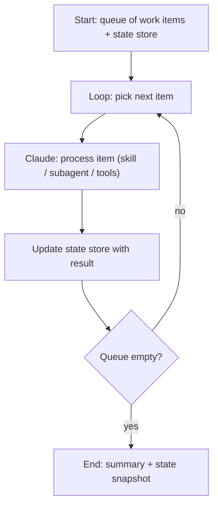

# Chapter 20 — Long-Running Claude

*Last verified: 2026-04-19 — Prerequisites: Ch 09, Ch 17, Ch 19 — Status: Advanced*

**Builds on:** [`../agents/29-modern-patterns.md`](../agents/29-modern-patterns.md) (Ralph loops, long-running harnesses).

---

## Concept

Long-running Claude is the pattern where a single coherent agent runs for **hours or days**, processing a large body of work through repeated loop iterations [9]. The Anthropic scientific-computing case study is the canonical example: a Claude-powered loop that digests thousands of paper PDFs, extracting structured findings, running for days on end.

Master-class framing: long-running Claude is not "many short sessions stitched together." It's a coherent loop with durable state, explicit iteration boundaries, and observability. Chapter 29 of `agents/` names this pattern "Ralph loops" — here we specialize to Claude Code's specific mechanics.

## How it works

### The Ralph loop shape



Three requirements for durable long-running:

1. **External queue / work list** — the agent doesn't hold work in context; it pulls from a file, SQLite, or queue
2. **External result store** — outputs go to disk/DB, not conversation history
3. **Stateless-ish iterations** — each loop iteration starts with a clean (or compacted) context; the agent is robust to restart

### Implementation patterns

**Headless-in-a-loop:**

```bash
while read -r file; do
  claude -p "process $file; append findings to findings.jsonl" \
    --permission-mode acceptEdits \
    --dangerously-skip-permissions  # sandboxed only
done < work-queue.txt
```

Each `claude -p` invocation is a fresh session. State lives in `findings.jsonl`. If an iteration fails, retry it; the rest of the queue is unaffected.

**SDK-in-a-loop:**

```python
for item in work_queue:
    result = run_agent(
        prompt=f"Process: {item}",
        cwd=workdir,
        timeout=600,
    )
    store.append(item.id, result)
```

Cleaner than shell; better error handling. Use when you want typed result handling, retry logic, or metrics.

**Worktree-per-task:**

For work that requires code changes, give each task its own worktree (Ch 10):

```bash
for task in $(cat tasks.txt); do
  git worktree add "../work/$task" "work/$task"
  cd "../work/$task"
  claude -p "$(cat ../prompts/$task.md)"
  cd -
done
```

Isolated, parallel-safe, cleanup via `git worktree remove` when done.

## Why it matters

Long-running unlocks work the interactive TUI can't touch:

1. **Batch processing** — thousands of documents, logs, PRs, tickets. One agent, one loop, leave it running.
2. **Research loops** — the scientific computing case [9]: extracting structured data from a corpus. Claude's reading comprehension at scale.
3. **Continuous background work** — a skill that runs every N minutes, watching for triggering conditions. "Every hour, check for stale PRs; ping the author."
4. **Autonomous multi-step refactors** — kick off a large refactor; come back in 2 hours; review the diff.

## Design heuristics

**Externalize state.** Conversation history is *not* durable state. Work queue in a file, results in JSONL or SQLite, progress in a text log. The agent is stateless-ish.

**One iteration, one responsibility.** Don't have a single loop iteration do 5 things. One loop = one concern. Compose via queue dependencies.

**Checkpoint frequently.** After every N iterations, snapshot state. If the agent goes off the rails, you can resume from checkpoint.

**Bound blast radius.** Long-running + write access = amplified failure modes. Run in a sandbox (worktree + dev DB / read-only prod / ephemeral container). Ch 24 covers security.

**Observable.** A 4-hour loop you can't inspect mid-run is a 4-hour risk. Use hooks (Ch 14) to emit progress, heartbeat, and error telemetry. Or output structured progress to a file you `tail -f`.

## The restart-safe pattern

Every long-running loop should be **safe to kill and restart**:

1. State file as source of truth — "which items are done?"
2. Idempotent work items — re-processing produces the same result, no duplication
3. Start-up sanity check — "how many items remain?" logged at startup
4. Progress log — `tail -f progress.log` shows you where it is

If any of these are missing, your "long-running" loop is actually "long-running unless something goes wrong." Not the same thing.

## Debugging

**"Loop hung."**
→ Permissions prompt likely. For headless, ensure `settings.json` covers all tools, or use bypass in sandbox. For SDK, set timeouts.

**"Results are inconsistent across iterations."**
→ Context leaking between iterations. Are you reusing a session that you shouldn't be? Most Ralph loops want *fresh* context per iteration, with shared state only through the external store.

**"Token cost is ballooning."**
→ Cache isn't warming across iterations (each fresh session re-pays the CLAUDE.md write). Check Ch 06 — either keep CLAUDE.md tiny for Ralph loops, or batch smaller units into single long sessions.

## Key takeaway

**Long-running Claude works when state lives outside the conversation.** Externalize the work queue and the result store; make iterations stateless-ish; checkpoint often; bound the blast radius. The Ralph loop is a coordination pattern, not a magic spell — it's what emerges when you treat Claude as one loop iteration and build the machinery around it.

## See Also

- [`17-headless-mode.md`](17-headless-mode.md) — The underlying primitive
- [`10-worktrees.md`](10-worktrees.md) — Worktree-per-task for code-modifying loops
- [`23-observability.md`](23-observability.md) — Telemetry for long-running
- [`24-security.md`](24-security.md) — Blast-radius containment
- [`../agents/29-modern-patterns.md`](../agents/29-modern-patterns.md) — Ralph loops in general

## Sources

[9] Long-running Claude for scientific computing — <https://www.anthropic.com/research/long-running-Claude>
[2] Claude Code Best Practices — <https://www.anthropic.com/engineering/claude-code-best-practices>
[8] Shankar — "How I Use Every Claude Code Feature" — <https://blog.sshh.io/p/how-i-use-every-claude-code-feature>
