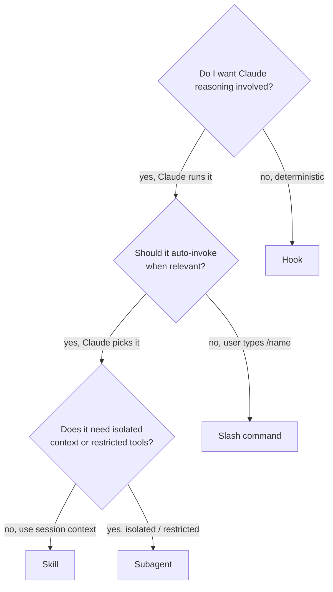

# Chapter 25 — The Four-Primitives Decision Tree

*Last verified: 2026-04-19 — Prerequisites: Ch 11, Ch 12, Ch 13, Ch 14 — Status: Meta*

**Builds on:** all four extension primitive chapters.

---

## Concept

This is the single chapter intermediate users would benefit from most. **When you want Claude Code to do something reusable, you choose one of four primitives — slash command, skill, subagent, or hook.** The choice has real consequences for how it gets invoked, what it costs, and how it fails.

Confusing them is the #1 mistake at this level. Getting them right is the biggest productivity jump available past the primer.

## The four options, one-line summary

| Primitive | You can | Invoked by | Chapter |
|---|---|---|---|
| **Slash command** | Run a prompt template fast | User only, via `/name` | Ch 11 |
| **Skill** | Run a procedure with its own tools | User or Claude (model-matched) | Ch 12 |
| **Subagent** | Delegate isolated work with fresh context | Parent Claude via `Agent` tool | Ch 13 |
| **Hook** | Enforce deterministic behavior on events | The harness itself | Ch 14 |

## The decision tree

### Walking the tree

**Start: Do I want Claude reasoning involved?**

- **No** — the behavior must happen deterministically (audit log, block command, run linter). That's a **hook**. No model, no judgment, just shell commands on events.

- **Yes** — Claude does the thinking. Go to Q2.

**Q2: Should it auto-invoke when relevant?**

- **No** — user types `/name` explicitly, every time. That's a **slash command**. Simpler than a skill, still versioned + committed. If you'd only ever type `/name` and never expect Claude to auto-suggest it, stop here.

- **Yes** — Claude reads the user's prompt, auto-suggests the tool. That means it needs a `description` field matched against user prompts. Go to Q3.

**Q3: Does it need isolated context or restricted tools?**

- **No** — runs in the main session, uses session context + whatever tools are available. That's a **skill**. Most productivity tools live here (`/tutor`, `/commit-ready`, `/onboard-repo`).

- **Yes** — isolated fresh context window, tool set restricted to the subagent's `tools:` frontmatter. That's a **subagent**. Use when the work would pollute the main conversation (deep research, code review, multi-perspective fan-out).

## Worked examples

### "I want every `git commit` to show me a reminder about the commit-message style."

- Deterministic? Yes — *always* show the reminder.
- → **Hook** (`PreToolUse` on `Bash(git commit:*)`)

### "I want a fast way to summarize my current branch's changes."

- Deterministic? No, Claude summarizes.
- Auto-invoke? No, I'll type `/branch-summary`.
- → **Slash command**

### "I want a mentor who explains concepts deeply. Claude should offer it when I seem confused."

- Deterministic? No, Claude teaches.
- Auto-invoke? Yes, via `description` with trigger words.
- Isolated context? No, the lesson lives in the main conversation.
- → **Skill** (`/tutor`)

### "Before `/tutor` teaches, gather external sources from the web. Keep that research out of the main conversation."

- Deterministic? No, Claude researches.
- Auto-invoke? Not by user prompt — `/tutor` triggers it.
- Isolated context? Yes, research shouldn't pollute parent's context.
- → **Subagent** (`tutor-researcher`)

### "Log every Bash command Claude runs for audit."

- Deterministic? Yes — *always* log, never judge.
- → **Hook** (`PreToolUse` on `Bash`)

### "Give me a one-shot command to run the pre-deploy checklist."

- Deterministic? No, Claude checks each item.
- Auto-invoke? No, I'll type `/ship-check`.
- → **Slash command**

### "When I ask to review a diff, Claude should get a specialist code-reviewer on it."

- Deterministic? No, review is judgmental.
- Auto-invoke? Yes — the parent notices "review" and delegates.
- Isolated context? Yes, review doesn't need main conversation.
- → **Subagent** (`code-reviewer`)

## Edge cases and rules of thumb

**When Q3 is borderline:** if you're not sure whether isolation helps, start as a **skill**. Upgrade to a subagent if you notice the skill's output starts to pollute your main conversation (too many tool calls, too many file reads).

**When Q2 is borderline:** if auto-invoke *would* be nice but your `description` is hard to write, start as a **slash command**. You can always promote to a skill later.

**Multiple primitives together:** the most powerful workflows chain primitives. `/tutor --research`:

- Slash invocation → **skill** (`/tutor`)
- Skill delegates to **subagent** (`tutor-researcher`)
- **Hook** fires on persist (`PostToolUse` on `Write`) to notify completion

Three primitives, one workflow.

## Common anti-patterns

**"I wrote a skill that just types a prompt."** → Should have been a slash command. Skills pay overhead (frontmatter, progressive disclosure, tool declarations) that's wasted if you're not using them.

**"I wrote a subagent that needs the main conversation's context."** → Should have been a skill. Subagents isolate by design; if you need shared context, don't isolate.

**"I wrote a hook that tries to 'suggest' something to Claude."** → Hooks can't reason. If you want judgment, use a skill. If you want enforcement, keep it deterministic.

**"I used a slash command for something I do every day without thinking."** → Probably belongs in CLAUDE.md (always-loaded advice) or a skill with a matching description (auto-invoked). The difference: is it a *template* you consciously run (slash) or a *habit* you want Claude to develop (skill + CLAUDE.md)?

## Key takeaway

**Four primitives. Three questions. The answer is usually clear once you ask them.** Deterministic? → Hook. User-only typed? → Slash command. Auto-invoked with main context? → Skill. Auto-invoked with isolation? → Subagent. When in doubt, start simple (slash command) and upgrade only when you notice a concrete need.

## See Also

- [`11-slash-commands.md`](11-slash-commands.md)
- [`12-skills-in-depth.md`](12-skills-in-depth.md)
- [`13-subagents-in-depth.md`](13-subagents-in-depth.md)
- [`14-hooks.md`](14-hooks.md)
- [`27-recipes.md`](27-recipes.md) — Concrete workflows using the right primitive

## Sources

[1] Claude Code Docs — <https://code.claude.com/docs/en/>
[3] Equipping agents with Agent Skills — <https://www.anthropic.com/engineering/equipping-agents-for-the-real-world-with-agent-skills>
