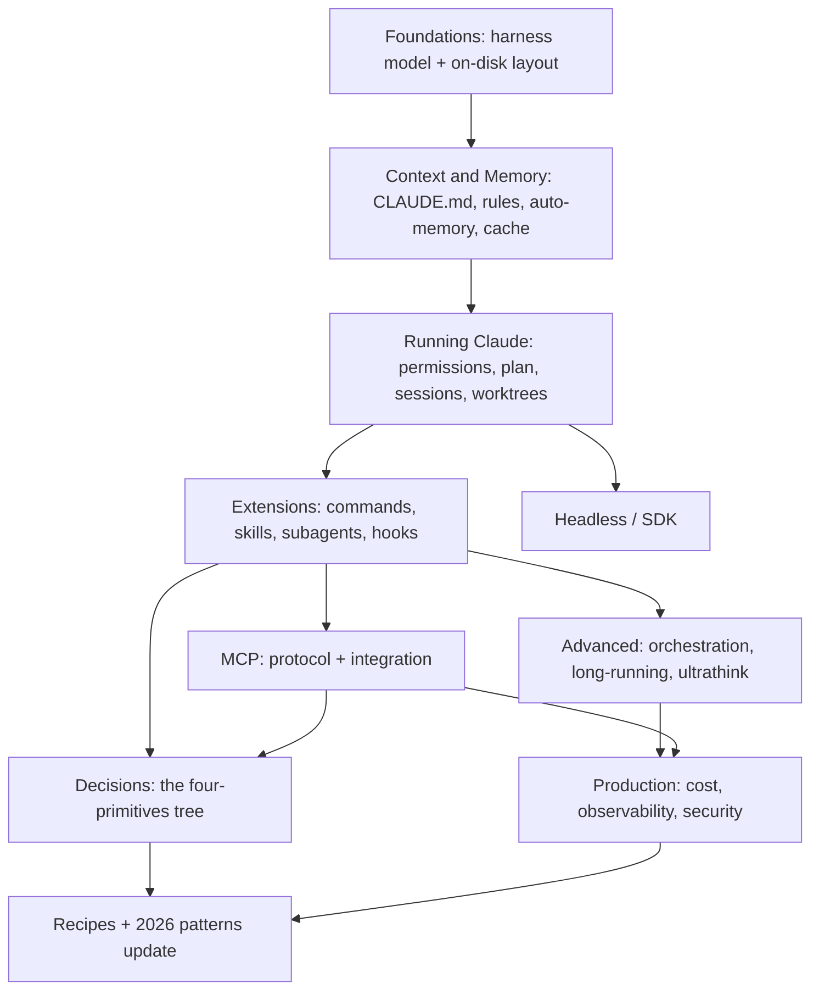

# Claude Code — Master Class

*A comprehensive companion guide for intermediate-to-advanced users who've absorbed the primer and want to level up.*

**Last verified: 2026-04-19**
**Claude Code baseline:** v2.1.77+ (`/branch` command, new cache TTL defaults)
**Sibling reference:** [`../agents/README.md`](../agents/README.md) — agent theory

---

## What this guide is

A multi-chapter reference for engineers who've installed Claude Code, written a few CLAUDE.md files, and now want the mental models, patterns, and second-level details that make the difference between using the tool and *commanding* it. Each chapter is under 1,500 words, stands alone, and cross-references both other chapters here and the deeper agent-theory in `../agents/`.

## What this guide is not

- A "getting started" tutorial — see the 45-min primer in the `claude-code-panel/` materials
- A replacement for the [official docs](https://code.claude.com/docs/en/) — cite them where they're canonical; this guide's value is the synthesis, the decision trees, and the practitioner nuance
- Comprehensive on MCP protocol internals — see [modelcontextprotocol.io](https://modelcontextprotocol.io); we cover the *integration*, not the spec

## How to read this guide

- **Linearly** if new to Claude Code past the primer — the dependency graph has a suggested order
- **By chapter** if you have a specific question — each chapter is self-contained and cross-referenced
- **By decision** if you're stuck on a design choice — jump to Ch 25 (the four-primitives decision tree)

## Dependency graph



---

## Chapters

### I. Foundations

**[01 — The mental model: agent harness](01-mental-model.md)** ✅
Claude Code is an agent harness — what that means, how the loop runs, how it relates to `agents/29-modern-patterns.md`. Fresh ground for Claude-Code-specific framing.

**[02 — The on-disk model](02-on-disk-model.md)** ✅
`~/.claude/`, project `.claude/`, `projects/<slug>/`, sessions as JSONL, memory dirs. Understanding the on-disk layout is what unlocks `/rewind`, `/resume`, `/branch`, auto-memory, and debugging.

### II. Context & Memory

**[03 — CLAUDE.md discipline](03-claude-md-discipline.md)** ✅
Composition, hierarchy (user → project → subfolder), what belongs where, size budget, imports, pruning. The single biggest skill separator at intermediate level.

**[04 — `.claude/rules/`: path-scoped modular instructions](04-claude-rules.md)** ✅
YAML `paths:` frontmatter, on-demand loading, symlink sharing, `~/.claude/rules/` for personal rules. When rules beat CLAUDE.md.

**[05 — Auto-memory internals](05-auto-memory.md)** ✅
`~/.claude/projects/<slug>/memory/MEMORY.md`, the 200-line / 25KB budget, topic-file splitting, what persists and what doesn't, curation discipline.

**[06 — Context & cache engineering](06-context-cache.md)** ✅
The prompt cache TTL (default dropped to 5 min in April 2026), stable-prefix discipline, `/compact` vs `/clear` mechanics, when to use 1M context vs stay small. Builds heavily on `agents/09-context-and-cache-engineering.md`.

### III. Running Claude

**[07 — Permission modes in depth](07-permission-modes.md)** ✅
Four modes (default / acceptEdits / plan / bypass), UI labels vs config names, how `Shift+Tab` cycles, why `bypassPermissions` isn't in the cycle, the trust model underneath.

**[08 — Plan mode](08-plan-mode.md)** ✅
When to reach for it, what gets surfaced, how to iterate on plans without executing, the plan-argument flag.

**[09 — Session lifecycle: resume, rewind, branch](09-session-lifecycle.md)** ✅
Sessions live as plaintext JSONL. `/rewind` inside a session, `/resume` from the picker, `/branch` (formerly `/fork`, renamed v2.1.77) to spawn a copy. What survives, what doesn't.

**[10 — Worktrees with Claude](10-worktrees.md)** ✅
Git worktrees as the parallelism primitive, session-per-worktree, per-worktree permission modes, the fork-don't-clear pattern. Merge-back is regular git.

### IV. Extensions — the four primitives

**[11 — Slash commands](11-slash-commands.md)** ✅
Files under `.claude/commands/`, user-invoked prompt templates, placeholders, composition, project-vs-user scopes. Often the simplest answer to "I want Claude to do X."

**[12 — Skills in depth](12-skills-in-depth.md)** ✅
Frontmatter, progressive disclosure, model-invoked vs user-invocable, writing descriptions that Claude auto-suggests reliably, tool-budget discipline. `/tutor` as the worked example.

**[13 — Subagents in depth](13-subagents-in-depth.md)** ✅
Isolation, fresh context windows, tool restriction, when to split, delegation semantics. Builds on `agents/13-when-to-split.md` and `agents/14-routing-patterns.md`.

**[14 — Hooks: deterministic lifecycle](14-hooks.md)** ✅
The full event taxonomy (PreToolUse, PostToolUse, UserPromptSubmit, Stop, SubagentStop, SessionStart, PreCompact, Notification), matchers, exit codes that short-circuit, observability wins.

### V. MCP

**[15 — MCP: tools as a protocol](15-mcp-protocol.md)** ✅
Brief refresher on MCP itself — builds on `agents/04-mcp-tools-as-protocol.md`. Registry, vendor neutrality, trust boundaries.

**[16 — MCP inside Claude Code](16-mcp-in-claude-code.md)** ✅
Three scopes (user / project `.mcp.json` / local), authentication flows, `/mcp` command, what happens on server failure, when to publish your own MCP server vs. a skill.

### VI. Headless & SDK

**[17 — Headless mode](17-headless-mode.md)** ✅
`claude -p`, piping, streaming JSON, CI integration, scheduled runs, why headless is the foundation for automation and remote control.

**[18 — The Agent SDK](18-agent-sdk.md)** ✅
The CLI and the Agent SDK are the same harness, differently packaged. Python + TypeScript. When to embed vs shell out.

### VII. Advanced

**[19 — Subagent orchestration patterns](19-subagent-orchestration.md)** ✅
Fan-out, routing, multi-perspective review, aggregator patterns. Builds on `agents/14-routing-patterns.md` and `agents/15-merge-vs-split.md`.

**[20 — Long-running Claude](20-long-running-claude.md)** ✅
Ralph loops, session-per-worktree, scientific-computing case study [9], when continuous Claude beats chat.

**[21 — `ultrathink` & thinking budgets](21-ultrathink.md)** ✅
Practitioner string vs. the official extended-thinking knob. Budget tuning, when depth pays, when it doesn't.

### VIII. Production

**[22 — Cost & cache engineering](22-cost-cache.md)** ✅
The April 2026 TTL change (still contested), model selection (Opus/Sonnet/Haiku tradeoffs), `/cost` habits, batch API, cache-friendly prompt layout.

**[23 — Observability](23-observability.md)** ✅
Hooks as telemetry emitters, structured logs, OpenTelemetry via TRACEPARENT (headless), what to monitor in long-running deployments.

**[24 — Security](24-security.md)** ✅
Prompt injection via tool outputs, MCP server supply-chain risks, YOLO mode actual blast radius, `allow`/`deny`/`ask` as defense in depth. Builds on `agents/20-guardrails-prompt-injection-security.md`.

### IX. Meta

**[25 — The four-primitives decision tree](25-decision-tree.md)** ✅
The single most important chapter: when to reach for slash command vs skill vs subagent vs hook. Synthesizes Chapters 11–14 into a decision framework.

**[26 — Claude Code patterns (2026 update)](26-modern-patterns-update.md)** ✅
What's changed since `agents/29-modern-patterns.md`. New patterns, deprecated ones, ongoing debates (YOLO, CLAUDE.md length, MCP maturity).

**[27 — Recipes: 10 workflows to steal](27-recipes.md)** ✅
Concrete workflows: pre-commit hook calling a skill, nightly headless audit, subagent code review, MCP-powered data lookup, long-running research loop, etc.

### Appendices

- **[Glossary](appendix-glossary.md)** ✅ — terms that show up repeatedly
- **[Cheat sheets](appendix-cheatsheets.md)** ✅ — CLI flags, slash commands, hook events, `settings.json` schema
- **[Rename / changelog log](appendix-changelog.md)** ✅ — `/fork` → `/branch`, "Claude Code SDK" → Agent SDK, TTL changes; when and why

---

## Legend

- ✅ fully written

All 27 chapters and 3 appendices are complete as of 2026-04-19.

## Extending this guide

To add a new chapter or expand one, invoke:

```
/tutor --research "claude-code: <new topic>"
```

`/tutor` will delegate to `tutor-researcher`, incorporate prior-art from the `agents/` series and this guide, and generate in the established format. Follow the existing chapter structure (concept → mechanism → why → debugging → key takeaway → see also → sources).

## Keeping this current

This is a living document for fast-moving technology. Quarterly:

1. Check the [CHANGELOG](https://github.com/anthropics/claude-code/blob/main/CHANGELOG.md) for renames / new features (Appendix — Changelog Log tracks major changes)
2. Re-verify "Last verified" dates across chapters
3. Update any chapter with drift; bump its date header

## Sources (master list, used across chapters)

See individual chapter Sources sections. The core list:

[1] Claude Code Docs — <https://code.claude.com/docs/en/>
[2] Claude Code Best Practices (Anthropic Engineering) — <https://www.anthropic.com/engineering/claude-code-best-practices>
[3] Equipping agents for the real world with Agent Skills (Anthropic Engineering) — <https://www.anthropic.com/engineering/equipping-agents-for-the-real-world-with-agent-skills>
[4] Claude Code CHANGELOG — <https://github.com/anthropics/claude-code/blob/main/CHANGELOG.md>
[5] Agent SDK overview — <https://code.claude.com/docs/en/agent-sdk/overview>
[6] Effective Context Engineering for AI Agents — <https://www.anthropic.com/engineering/effective-context-engineering-for-ai-agents>
[7] Model Context Protocol — <https://modelcontextprotocol.io>
[8] Shrivu Shankar, "How I Use Every Claude Code Feature" — <https://blog.sshh.io/p/how-i-use-every-claude-code-feature>
[9] Long-running Claude for scientific computing — <https://www.anthropic.com/research/long-running-Claude>
[10] Claude Code MCP docs — <https://code.claude.com/docs/en/mcp>
[11] Skill authoring best practices — <https://platform.claude.com/docs/en/agents-and-tools/agent-skills/best-practices>
[12] Advanced tool use — <https://www.anthropic.com/engineering/advanced-tool-use>
